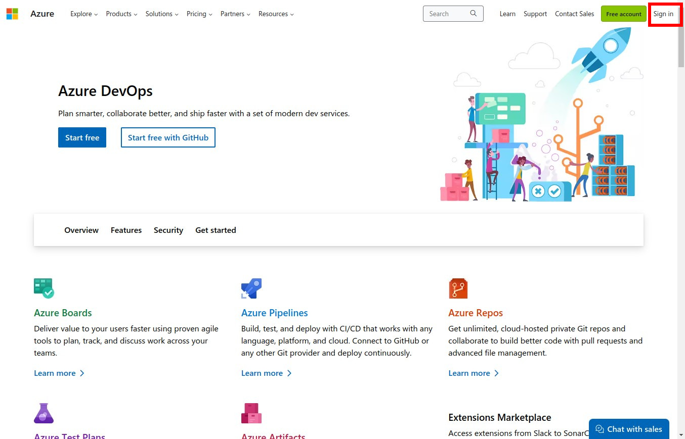
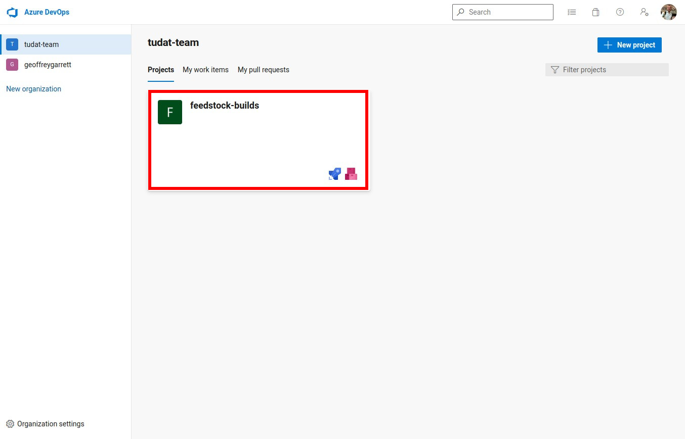
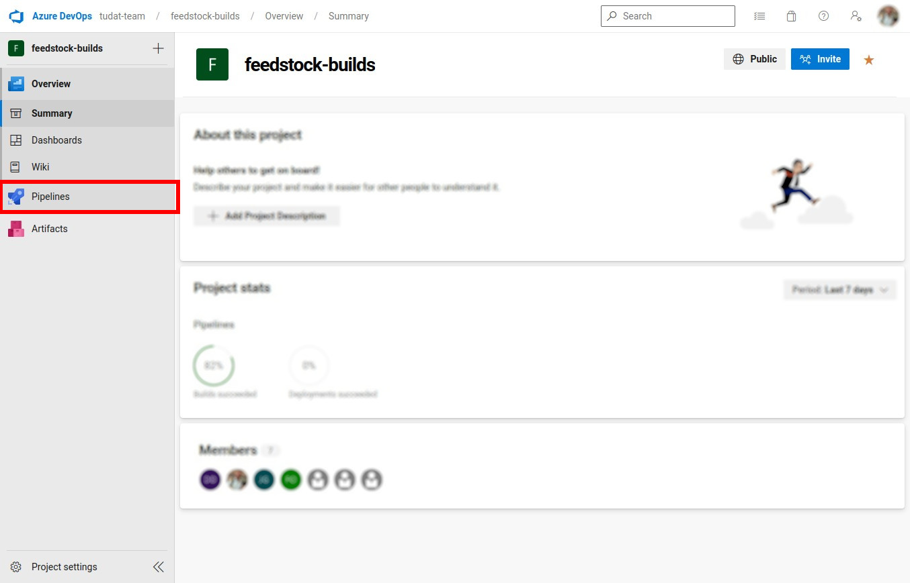
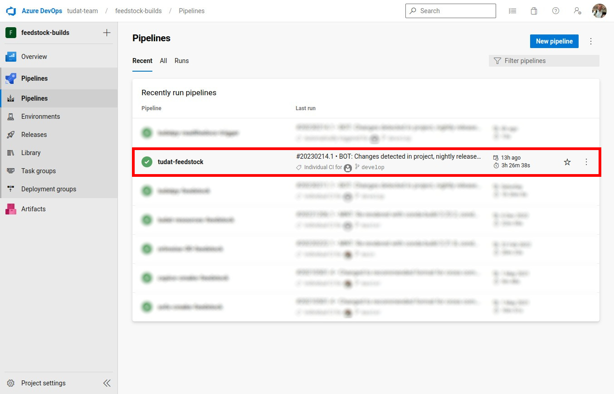
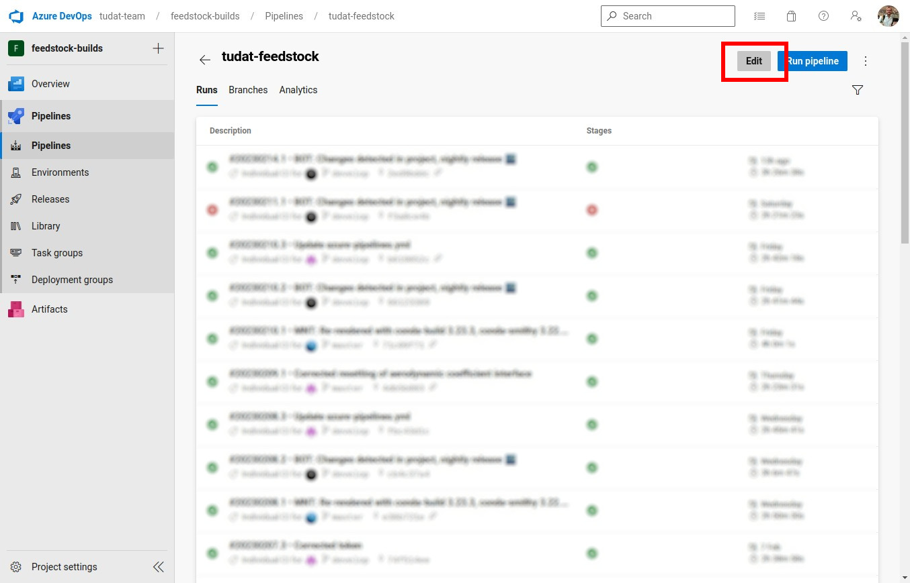
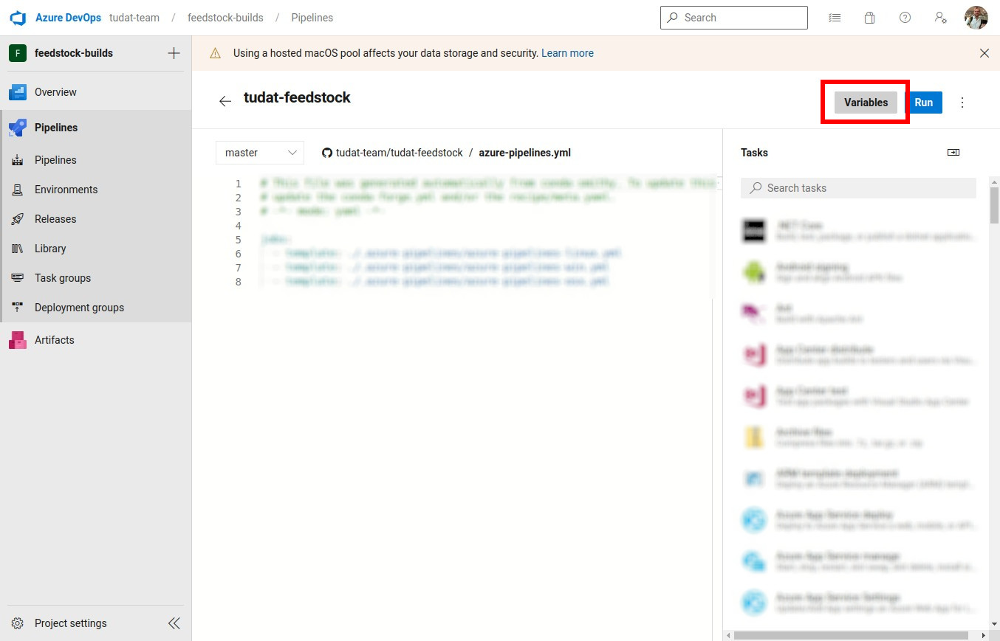
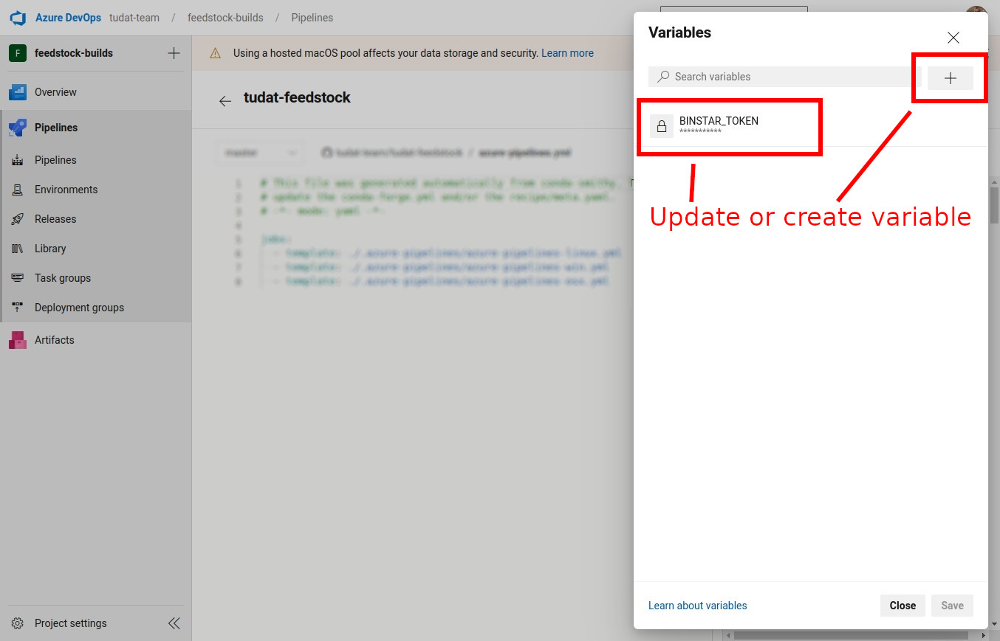

.. _Defining Environment Variables:

Defining Environment Variables
==============================

As software developers, it is common to store sensitive information, such
as access tokens, in environment variables for security purposes. This
information can then be easily retrieved and used within your code. In
this section, we will go over how to define environment variables on
various operating systems, shells, and cloud services. This documentation
is intended for developers of all skill levels, from beginner to
advanced. Whether you are working on Windows, Unix-based systems, or in
the cloud, this guide will provide you with the necessary information to
securely store and manage sensitive information.

Defining Environment Variables in Python
----------------------------------------

In order to use environment variables in a Python script, you can use the `os` module. The following code snippet demonstrates how to access and use an environment variable named `MY_VARIABLE` in a Python script:

.. code-block:: python

   import os

   my_variable = os.environ.get("MY_VARIABLE")
   if my_variable:
       # Use my_variable in your script
       print("MY_VARIABLE is set to:", my_variable)
   else:
       # MY_VARIABLE is not set, handle the error appropriately
       print("MY_VARIABLE is not set.")

Defining Persistent Environment Variables in Unix
-------------------------------------------------

In Unix-based systems, environment variables can be defined persistently across terminal sessions by adding the `export` statements to your shell profile file. The location and name of this file depend on the shell you are using. For the `bash` shell, the file is typically called `.bashrc` and is located in your home directory (`~/`). For the `zsh` shell, the file is typically called `.zshrc` and is also located in your home directory (`~/`).

The following code snippet demonstrates how to define an environment variable named `MY_VARIABLE` in your shell profile file for the `bash` shell:

.. code-block:: bash

   # Add this line to your .bashrc file located in ~/
   export MY_VARIABLE="value"

Note: If you are using `zsh` instead of `bash`, you would add the `export` statements to your `.zshrc` file located in your home directory (`~/`) instead of your `.bashrc` file.

Defining Temporary Environment Variables in Bash script `.sh` (Unix)
--------------------------------------------------------------------

In order to use environment variables in a Bash script, you can use the `export` keyword. The following code snippet demonstrates how to define and access an environment variable named `MY_VARIABLE` in a Bash script:

.. code-block:: bash

   export MY_VARIABLE="value"

   my_variable=$MY_VARIABLE
   if [ -n "$my_variable" ]; then
       # Use $my_variable in your script
       echo "MY_VARIABLE is set to: $my_variable"
   else
       # MY_VARIABLE is not set, handle the error appropriately
       echo "MY_VARIABLE is not set."
   fi

Defining Environment Variables in Windows using a .bat File
----------------------------------------------------------

In Windows, you can also define environment variables in a batch file (`.bat`) and run it to set the variables persistently.

To define environment variables in a batch file, you can use the `set` command, followed by the name of the variable and its value. Here's an example of setting an environment variable named `MY_VARIABLE` to the value `value` in a batch file, with an exception catch:

.. code-block:: batch

   @echo off
   set MY_VARIABLE=value
   if errorlevel 1 (
      echo MY_VARIABLE could not be set
   ) else (
      echo MY_VARIABLE was set successfully
   )

Save this file with a `.bat` extension, for example, `set_environment_variables.bat`, and double-click on it to run it. If the environment variable was set successfully, the message "MY_VARIABLE was set successfully" will be displayed. If there was an error setting the variable, the message "MY_VARIABLE could not be set" will be displayed instead.

Note: To make the environment variable persistently available across all sessions, you can add the batch file to your startup folder, which is located at `C:\Users\<username>\AppData\Roaming\Microsoft\Windows\Start Menu\Programs\Startup`.

Defining Persistent Environment Variables in Windows
----------------------------------------------------

In Windows, environment variables can be defined persistently by adding them to the system environment variables or to the user environment variables.

To add a new environment variable or update an existing one for a single user, follow these steps:

1. Open the Start menu and search for "Environment Variables".
2. Click on "Edit the system environment variables".
3. Click on the "Environment Variables" button.
4. Under "User variables", click on the "New" button to add a new environment variable or click on an existing variable and click on "Edit" to modify it.
5. Enter the name and value of the environment variable and click "OK".

To add a new environment variable or update an existing one for all users, follow these steps:

1. Open the Start menu and search for "Environment Variables".
2. Click on "Edit the system environment variables".
3. Click on the "Environment Variables" button.
4. Under "System variables", click on the "New" button to add a new environment variable or click on an existing variable and click on "Edit" to modify it.
5. Enter the name and value of the environment variable and click "OK".

.. note::
   After defining a new environment variable, you may need to restart any open command prompt windows for the changes to take effect.

Defining Environment Variables in an Azure Pipeline
---------------------------------------------------

.. note::
   This section is intended for maintainers of the feedstock repositories (at current). If you are not a maintainer, you can safely ignore this section. A more advanced guide on Azure Pipelines can be found `here <https://learn.microsoft.com/en-us/azure/devops/pipelines/process/variables>`_.

1. Navigate to https://dev.azure.com/ and sign in.

2. Click the `feedstock-builds` project under the `tudat-team` organization (https://dev.azure.com/tudat-team).

3. Click "Pipelines" under the `feedstock-builds` project.

4. Click on the specific pipeline in which you want to set the environment variable (e.g. `tudat-feedstock`).

5. Click "Edit" in the top-right of the page.

6. Click "Variables" in the top-right of the page.

7. Update an existing token (e.g. `BINSTAR_TOKEN`), or create a new one with the `+` icon.

.. important::
   It is crucial to keep the environment variables private and secure. Ensure that you do not share them or commit them to a public repository, as this could lead to security issues.

Defining Environment Variables in an Azure Project
--------------------------------------------------

.. note::
   This section is the desired way of defining environment variables in Azure. However, it is currently not possible to define environment variables in an Azure project due to `conda-smithy` overwriting the pipeline yaml. This is a known issue, and we are working on a solution. In the meantime, please use the method described in the previous section.

`<TODO: Add instructions on how to define environment variables in an Azure project>`_