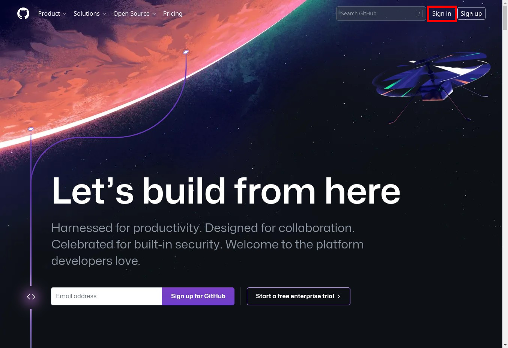
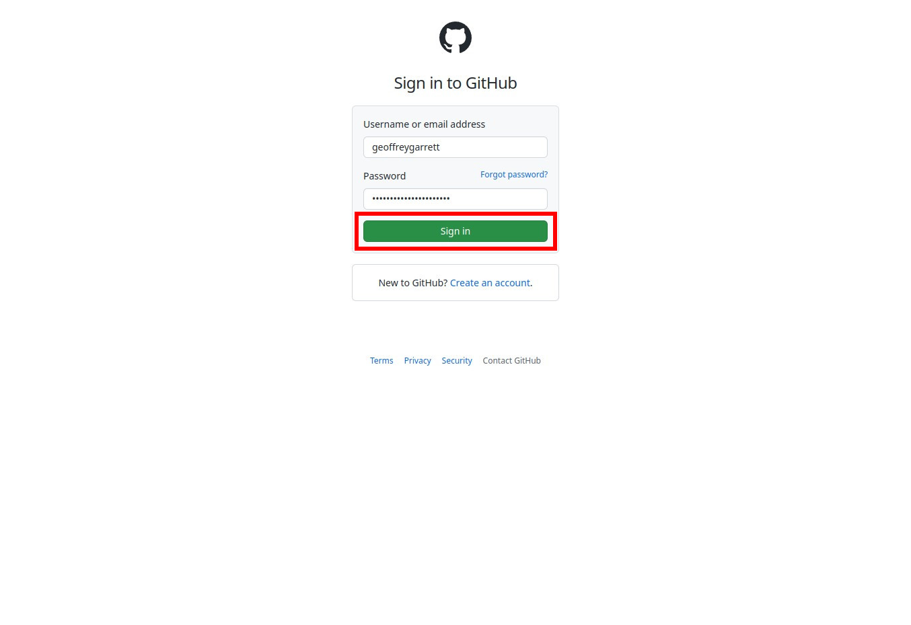
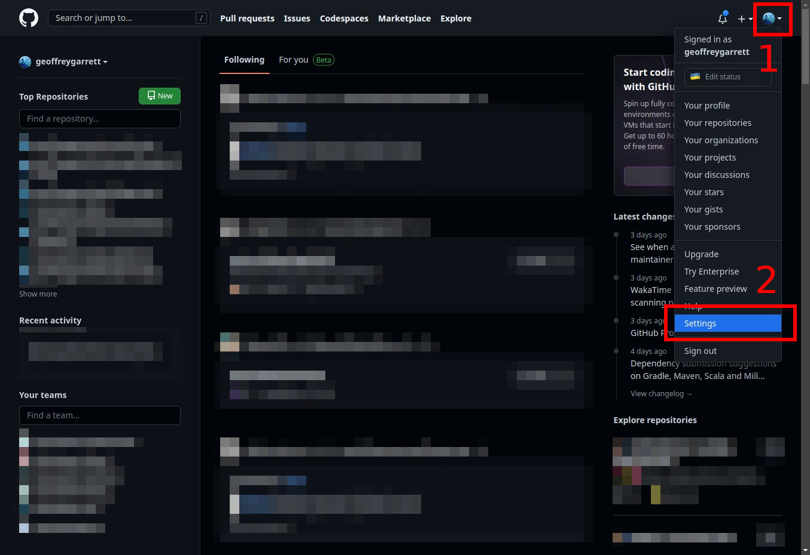
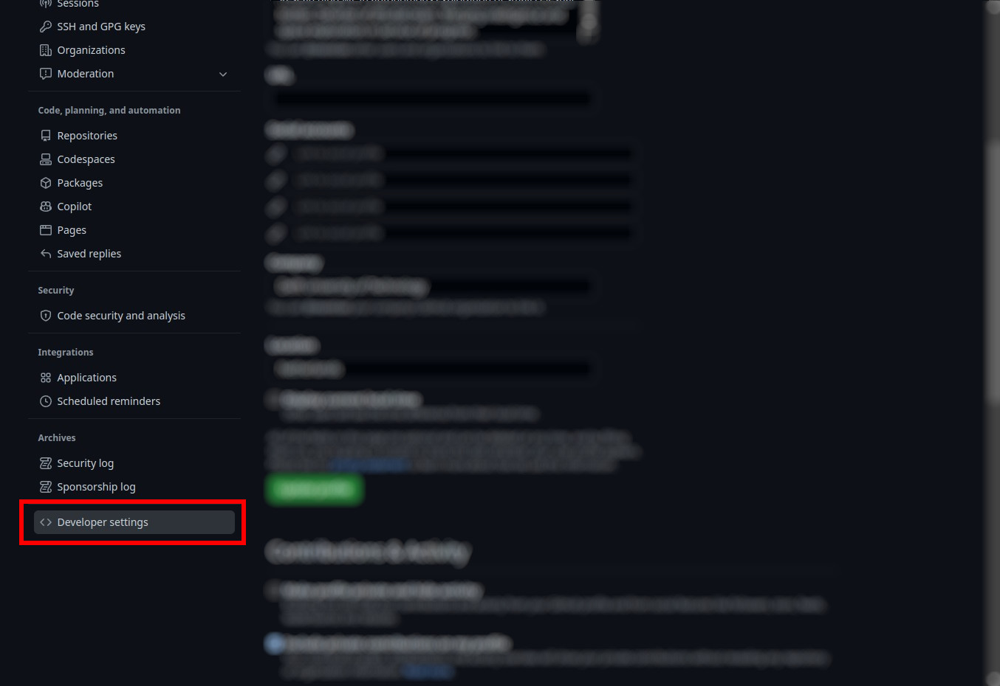
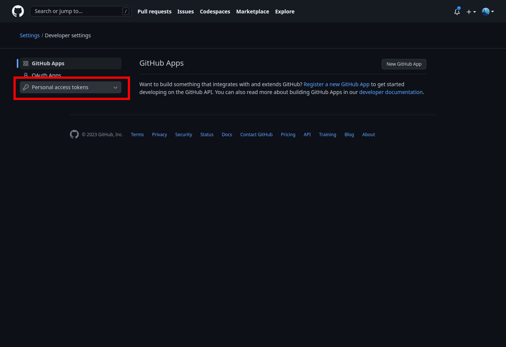
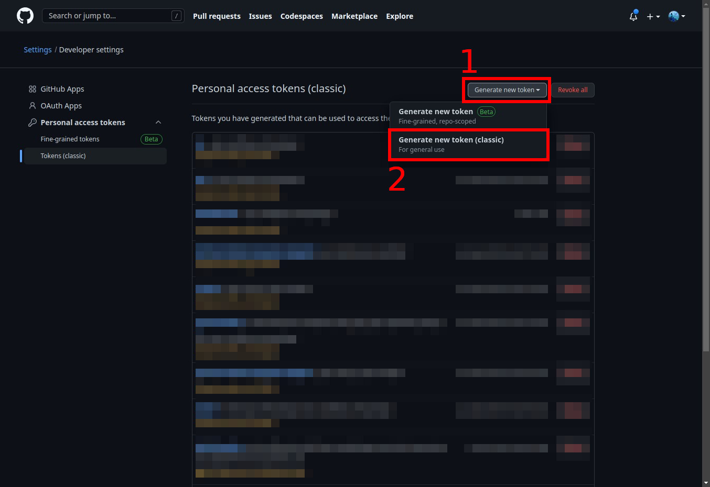
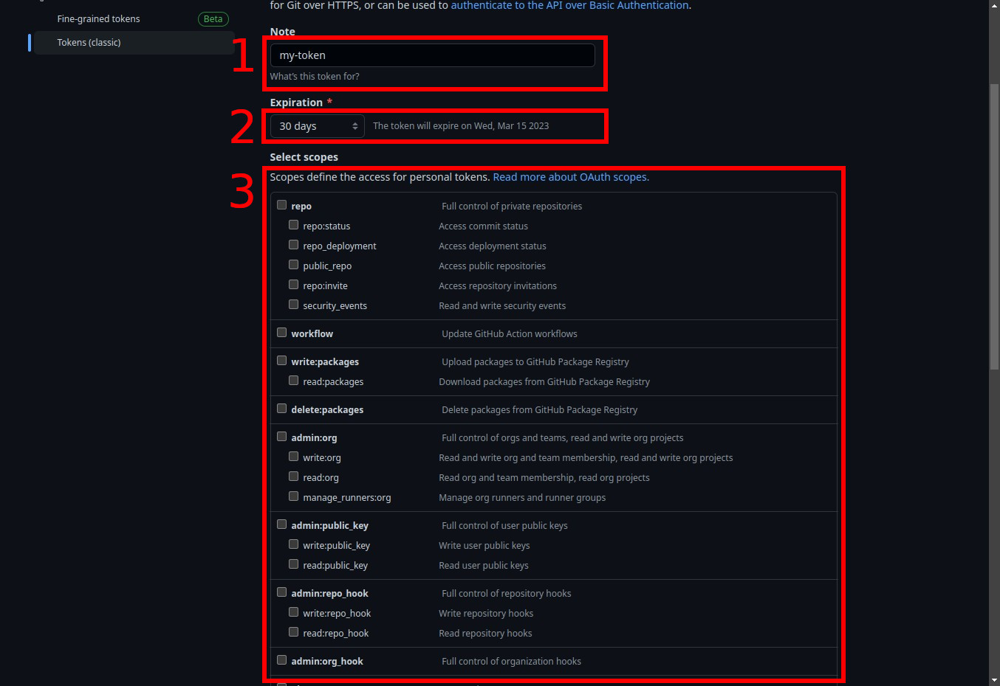

.. _Managing Access Tokens:

Managing Access Tokens
======================

Generating Access Tokens
------------------------

In this section, we will provide step-by-step instructions for generating access tokens on Azure and GitHub.

Generating Tokens on Azure
^^^^^^^^^^^^^^^^^^^^^^^^^

`<TODO>`

Generating User Tokens on GitHub
^^^^^^^^^^^^^^^^^^^^^^^^^^^^^^^^

1. Navigate to `GitHub <https://github.com>`__. After this, go to step 3 if you are already signed in, otherwise, click "Sign in" at the top-right of the landing page.

2. Enter your details and click "Sign in".

.. note::
    Dark mode makes you a better developer.

3. Click on your profile picture at the top-right of the page to reveal a drop-down menu, select "Settings".

4. Click on "Developer settings".

5. Click on "Personal access tokens".

.. note::
    Currently, we use the classic tokens. Any developer is free to use the new fine-grained tokens, which are in Beta at the time of writing the current documentation, so long as it works. That developer must just modify the documentation accordingly.

6. Click on "Generate new token (classic)".

.. important::
    The correct selection of the scopes is pertinent to the continued operation of the dependent systems. This may influence one to over-scope the permissions, in order to avoid having to scrutinize the required ones to save time, however over-scoping is a bad practice and should be avoided, so as to avoid any malicious attempts.  See the documentation stating the required scopes from the relevant service.

7. Name your token, set an expiration time-delta, select the appropriate scopes, and finally click "Generate token".

8. Click on the copy icon provided, next to the token (or copy it yourself).

.. image:: graphics/github_user_token_8.jpeg

.. important::
    It is important to never commit code with the token. If this is done, the token will be deactivated immediately, automatically in most cases by the relevant service. For example, if you commit a Github token to Github, it will be automatically deleted. This is a good safety feature to have, but if done with a token which multiple components in our system are dependent on, the amount of work to rectify this will be tedious and better avoided through taking mental note of this now.

Generating Organization Tokens on GitHub
^^^^^^^^^^^^^^^^^^^^^^^^^^^^^^^^^^^^^^^^

