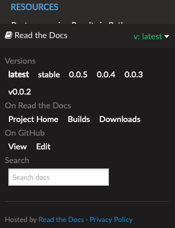

**********************************
Release an online version
**********************************

Every time you make a modification to the documentation, you are required to:

1. branch out from develop to a ``feature/FEATURE_NAME`` branch (see :ref:`Code Collaboration`)
2. make the necessary modifications (see :ref:`Sphinx Documentation`)
3. test the build locally (see :ref:`Sphinx Documentation)`
4. update the ``CHANGELOG.md``
5. open a Pull Request into ``develop`` (see :ref:`Code Collaboration`)
6. issue an unstable version of the documentation (see :ref:`Release Versioning`)

The reviewer is required to:

1. review the pull request by testing it locally
2. if needed, ask the developer for modifications
3. merge into develop, push and check the result online (``latest`` version)
4. release a stable version with ``bumpversion``
5. merge develop into master to deploy a ``stable`` version of the docs

To host our online documentation, like the one you are reading, we use `readthedocs <https://readthedocs.org>`_.

Deploying a version with ``readthedocs``
*****************************************

.. seealso:: In this guide, we assume that the reader is familiar with how to release new versions of the
   documentation locally through ``bumpversion`` (see :ref:`bump_version`).

Readthedocs uses git tags to build different versions of the documentation, with two additional versions:

- ``latest`` (corresponding to the latest commit on ``develop``)
- ``stable`` (corresponding to the most recent version released on ``master``)

.. _readthedocs_menu:

.. note:: The landing pages for both tudat-space and the developer docs point to the ``stable`` version. It is still
    possible to switch to ``latest`` through the readthedocs panel (bottom left of the page, as shown below).

    .. figure:: _static/readthedocs_menu.png
        :width: 200px
        :align: center

Once commits are pushed to the ``develop`` branch on ``origin`` (or a new version tag is pushed to ``main``), the
documentation is built automatically by `readthedocs <readthedocs.org>`_. If changes are pushed to other branches,
no documentation is built.

Stable vs. unstable versions
------------------------------

Depending whether the release is stable or unstable, different things happen:

- if the release is *stable* (e.g., v0.1.2), the resulting documentation is published on the website and a new version
  will be visible in the readthedocs menu)
- if the release is *unstable* (e.g., v0.1.2dev0),
  the resulting documentation will not be built nor published on the website

Activating unstable versions
-----------------------------

Unpublished versions, such as unstable versions or versions from other branches, can still be activated by authorized
users (i.e., readthedocs maintainers) to be viewed online
and shared with others through a link. This can be done by clicking on the readthedocs menu and selecting "Builds",
then "Versions" and activate build. Make it hidden to avoid it being listed on the website and searchable by the users.

Clicking on the right build allows to see it in the browser and copy
the related link to share it with collaborators. This is particularly useful to share drafts of the output
documentation without modifying stable versions.

.. seealso::
    Read more on how readthedocs deals with `versions <https://docs.readthedocs.io/en/stable/versions.html#>`_.

How different versions are used in tudat
-----------------------------------------

This is how we envisage different versions of the online docs:

- the ``stable`` documentation with proper versioning is the official documentation and can be linked to
  different software versions

- the ``latest`` documentation is useful to deploy documentation quickly and, if needed, also use it for
  giving/receiving feedback

- the inactive documentation (corresponding to unstable versions or other branches) can be used for
  giving/receiving feedback, but they have to be activated and hidden by maintainers of readthedocs

Troubleshooting
****************

In this section, we collect the most recurring bugs that can happen while using ``readthedocs``, hoping that it will
save precious time to future Tudat contributors.

No changes shown in online docs
---------------------------------

It can happen that, after pushing your changes to the ``origin`` repository, no changes are shown on the actual
website (e.g., on tudat-space or on this website). Some suggestions to identify the problem will follow:

1. Check that you pushed to the ``main`` branch. The documentation is built by readthedocs only if changes are pushed
   to that branch.
2. Check that the build was successful. This can be monitored via the "Builds" link in the readthedocs_menu_ (see
   screenshot above). If the build was not successful, you can click on it and see the output of the build. This can
   be helpful to identify where things are going wrong.

.. figure:: _static/build_output.png
    :width: 600px
    :align: center
